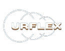

  

  
  
  
  
  

## 📲 Sobre

  Este projeto é a primeira landing page da startup Urflex Benefícios Corporativos, onde falamos sobre nossa proposta e oferecemos nossos serviços ao cliente.

## 📋 Sumário

   * [Sobre]()
   * [Sumário]()
   * [Referências]()
   * [Autores]()

## 🔧 Referências

- [Urflex Landing Page Figma](https://www.figma.com/design/hpcyhdzWC3fnhniSaTa8rt/Urflex-Landing-Page?node-id=0-1&t=aSAc7wiB5UYo1P3h-1)
- [React](https://react.dev/)
- [Javascript](https://developer.mozilla.org/pt-BR/docs/Web/JavaScript)
- [Vite](https://vitejs.dev/)
- [Bootstrap](https://getbootstrap.com/)
- [Styled-Components](https://styled-components.com/)

## ✍️ Autores

<b><i>[Beatriz Fernandes](https://github.com/Beatrizfernan), <b></i><i>[Cristiano Mendes](https://github.com/CristianoMends), </i><b><i>[Gustavo Fernandes](https://github.com/gufernandess), </i><b><i>[Marina Paula](https://github.com/marin4paula), </i><b><i>[Yasmin Emily](https://github.com/YasminEmily)</i>